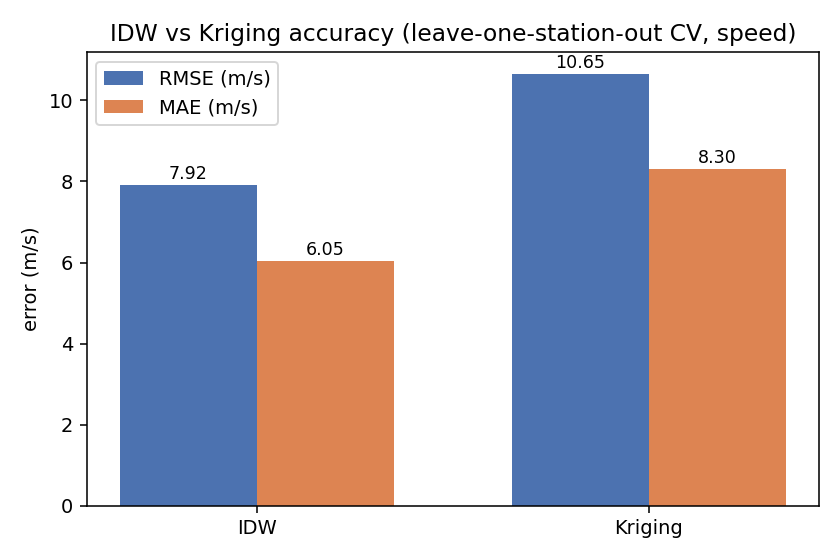
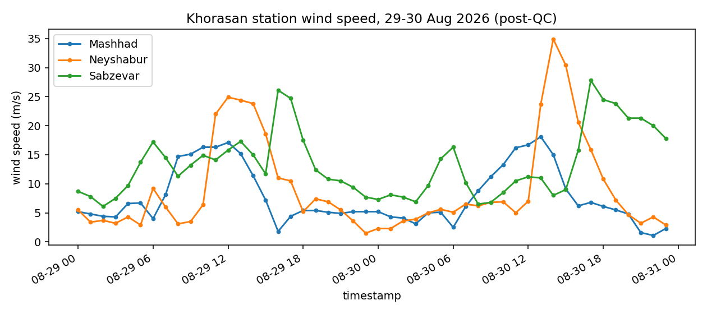
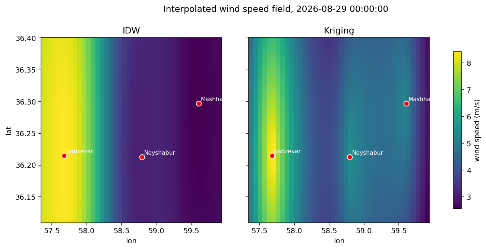

# گزارش نهایی پیش‌پردازش — گام ۲ (Preprocessing Report)

**تاریخ:** ۱۱ شهریور ۱۴۰۵
**مسئول:** امیرعلی
**وضعیت:** انجام شده
**اولویت:** معمولی
**ددلاین:** ۳۰ مرداد ۱۴۰۵، ۱۷:۰۰ به وقت ایران

---

## هدف

این سند، گزارش نهایی فرآیند پیش‌پردازش پروژه Roshd Wind Pathfinder است:
مستندسازی کنترل کیفیت، روش‌های درون‌یابی (IDW و Kriging)، بررسی پیوستگی
داده‌ها، و آماده‌سازی داده برای مسیریابی — به‌همراه نتایج واقعی به‌دست‌آمده
از داده مرجع خراسان، برای استفاده در گام ۳ (مسیریابی).

---

## چک‌لیست تسک (Items to Check)

| # | آیتم | وضعیت |
|---|------|--------|
| ۱ | جمع‌آوری نتایج همه ماژول‌های پیش‌پردازش | ✅ |
| ۲ | مستندسازی روش‌ها و پارامترها | ✅ |
| ۳ | تهیه نمودارها و نمونه‌های خروجی | ✅ |
| ۴ | جمع‌بندی دقت روش‌ها (IDW در برابر Kriging) | ✅ |
| ۵ | ارائه گزارش نهایی فارسی | ✅ (همین سند) |
| ۶ | پیوست‌سازی کدها و مستندات | ✅ (بخش پیوست) |

---

## ۱. جمع‌آوری نتایج ماژول‌های پیش‌پردازش

داده مرجع مصرفی همه ماژول‌ها: ۳ ایستگاه خراسان (Mashhad, Neyshabur,
Sabzevar)، ۱۴۴ رکورد ساعتی طی ۲۹ تا ۳۰ مرداد ۱۴۰۵.

| ماژول | مسئول | فایل کد | تست | وضعیت واقعی |
|---|---|---|---|---|
| کنترل کیفیت (QC) | مهدی | `src/qc/wind_qc.py` | ۲ | ✅ روی داده مرجع اجرا شده: ۱۴۴ از ۱۴۴ رکورد معتبر، ۰ رکورد حذف‌شده (`data/khorasan_qc_report.json`) |
| درون‌یابی IDW | آرمان | `src/preprocessing/idw.py` | ۷ | ✅ |
| درون‌یابی Kriging | آرمان | `src/preprocessing/kriging.py` | ۱۱ | ✅ |
| ذخیره‌سازی/کش داده | آرمان | `src/data/cache.py` | ۱۱ | ✅ |
| پیوستگی زمانی-مکانی | امیرعلی | `src/preprocessing/consistency.py` | ۱۲ | ✅ (PR #13) — ۰ گپ زمانی، ۳۳ از ۱۴۴ مقایسه مکانی فراتر از آستانه (جزئیات در بخش ۲) |
| آماده‌سازی داده مسیریابی | مهدی | `src/preprocessing/pathfinding_preparation.py` | ۷ | ✅ (PR #16) |

**جمع کل تست‌های پیش‌پردازش:** ۵۰ تست، همه پاس (`pytest` روی کل ریپو).

⚠️ **یک نکته مهم درباره داده نمونه:** فایل `data/khorasan_pathfinding_ready.csv`
که در PR #15 اضافه شد، در تمام ۲۳٬۰۴۰ سطرش مقادیر `wind_speed`,
`wind_direction`, `u`, `v` خالی (NaN) است — این فایل هنوز با داده واقعی
پر نشده و صرفاً اسکلت گرید (`timestamp × altitude × lat × lon`) را نشان
می‌دهد. کد ماژول `pathfinding_preparation.py` خودش (که در بخش ۱ تأیید شد)
درست کار می‌کند؛ مشکل فقط در تولید نشدنِ دوبارهٔ این فایل نمونه با داده
واقعی خروجی زنجیره QC→IDW/Kriging→Consistency است.

---

## ۲. مستندسازی روش‌ها و پارامترها

### کنترل کیفیت (`WindQualityControl`)
- بازه معتبر سرعت: `[0, 120]` m/s؛ جهت: `[0, 360]`°
- تشخیص پرت زمانی: z-score با آستانه `3.0`، جهش حداکثر سرعت `30` m/s، جهش حداکثر جهت `150`°
- تشخیص پرت مکانی: شعاع همسایگی `0.25` درجه، آستانه z-score `3.0`، حداقل ۳ همسایه

### درون‌یابی IDW (`IDWInterpolator`)
- روش: میانگین وزنی معکوس فاصله، $w_i = 1/d(x,x_i)^p$، توان پیش‌فرض `p=2.0`

### درون‌یابی Kriging (`KrigingInterpolator`)
- برازش واریوگرام تجربی و مدل (`spherical` پیش‌فرض؛ `exponential`, `gaussian`, `linear` هم پشتیبانی می‌شوند)
- پیش‌بینی با حل سیستم خطی کوواریانس (Ordinary Kriging)

### پیوستگی زمانی-مکانی (`SpatiotemporalConsistencyChecker`)
- بازه نمونه‌برداری مورد انتظار: ۱ ساعت؛ گپ ≤ ۲ گام قابل‌ترمیم با درون‌یابی خطی/دایره‌ای
- آستانه ناسازگاری مکانی (کالیبره‌شده روی صدک ۹۰ داده واقعی): اختلاف سرعت > ۱۵ m/s یا اختلاف جهت > ۱۵۰°، بین ایستگاه‌های نزدیک‌تر از ۲۵۰ کیلومتر
- نتیجه روی داده مرجع: ۰ گپ زمانی؛ ۳۳ از ۱۴۴ مقایسه مکانی (۲۳٪) بالاتر از آستانه — عمدتاً به‌دلیل تفاوت طبیعی جهت باد بین ایستگاه‌های ۷۰ تا ۱۷۳ کیلومتری (اثر توپوگرافی محلی)، نه خطای داده

### آماده‌سازی داده مسیریابی (`prepare_for_pathfinding`)
- ساخت گرید منظم `timestamp × altitude × lat/lon` روی ۴ تراز ارتفاعی: ۵۰۰، ۱۰۰۰، ۱۵۰۰، ۲۰۰۰ متر
- یکسان‌سازی واحد سرعت (m/s، با پشتیبانی تبدیل از km/h و kt) و جهت (`[0, 360)`)
- تبدیل سرعت/جهت به مؤلفه‌های برداری `u, v` و نسخه نرمال‌شده `u_normalized, v_normalized`

---

## ۳. نمودارها و نمونه‌های خروجی

### مقایسه دقت IDW در برابر Kriging


### سری زمانی سرعت باد سه ایستگاه (پس از QC)


### نمونه میدان درون‌یابی‌شده (۲۹ مرداد، ساعت ۰۰:۰۰)


اسکریپت تولید این سه نمودار: `scripts/generate_preprocessing_report_assets.py`
(قابل اجرای مجدد با `python scripts/generate_preprocessing_report_assets.py`).

---

## ۴. جمع‌بندی دقت روش‌ها (IDW در برابر Kriging)

روش ارزیابی: **leave-one-station-out cross-validation** روی سرعت باد —
برای هر رکورد، مقدار یک ایستگاه کنار گذاشته و از دو ایستگاه باقی‌مانده با
هر دو روش تخمین زده شد (۱۴۴ مقایسه).

| روش | RMSE (m/s) | MAE (m/s) |
|---|---|---|
| IDW | **۷.۹۲** | **۶.۰۵** |
| Kriging | ۱۰.۶۵ | ۸.۳۰ |

**نتیجه:** روی این داده مرجع، IDW دقت بهتری نسبت به Kriging دارد.

**محدودیت مهم روش‌شناسی (باید در گزارش صادقانه ذکر شود):** این مقایسه فقط
با ۳ ایستگاه انجام شده، یعنی هر پیش‌بینی Kriging تنها از ۲ نقطه منبع
واریوگرام را برازش می‌کند — با ۲ نقطه فقط یک فاصله زوجی وجود دارد که برای
برازش ۳ پارامتر واریوگرام (sill، range، nugget) به‌شدت کم و غیرقابل‌اعتماد
است. برتری IDW در این نتیجه بیشتر بازتاب‌دهنده تعداد کم ایستگاه‌هاست تا
برتری ذاتی روش IDW؛ Kriging معمولاً با شبکه‌ای متراکم‌تر از ایستگاه‌ها
(حداقل ۵-۱۰ نقطه) دقت بهتری نشان می‌دهد. توصیه می‌شود این مقایسه با داده
واقعی‌تر (ایستگاه‌های بیشتر) در آینده تکرار شود.

---

## ۵. جمع‌بندی برای گام ۳ (مسیریابی)

- زنجیره پیش‌پردازش (QC → درون‌یابی → پیوستگی → آماده‌سازی مسیریابی) از نظر
  **کد** کامل و تست‌شده است (۵۰ تست پاس).
- برای شروع گام ۳، دو اقدام لازم است:
  1. بازتولید `data/khorasan_pathfinding_ready.csv` با داده واقعی (چون
     نسخه فعلی خالی است — نگاه کنید به بخش ۱).
  2. با توجه به محدودیت روش‌شناسی بخش ۴، اگر داده ایستگاه‌های بیشتری در
     دسترس قرار گرفت، مقایسه IDW/Kriging را با آن‌ها تکرار کنید.

---

## پیوست: کدها و مستندات

- `src/qc/wind_qc.py`, `tests/test_wind_qc.py`
- `src/preprocessing/idw.py`, `tests/preprocessing/test_idw.py`
- `src/preprocessing/kriging.py`, `tests/preprocessing/test_kriging.py`
- `src/preprocessing/consistency.py`, `tests/preprocessing/test_consistency.py`, `docs/task_spatiotemporal_consistency.md`
- `src/preprocessing/pathfinding_preparation.py`, `tests/test_pathfinding_preparation.py`, `docs/task_data_prep_pathfinding.md`, `docs/PATHFINDING_DATA_FORMAT.md`
- `src/data/cache.py`, `tests/data/test_cache.py`, `docs/task_data_caching.md`
- `scripts/generate_preprocessing_report_assets.py` — تولید نمودارهای این گزارش

**شواهد اجرا:**
```
$ ruff check .
All checks passed!

$ pytest
50 passed
```
